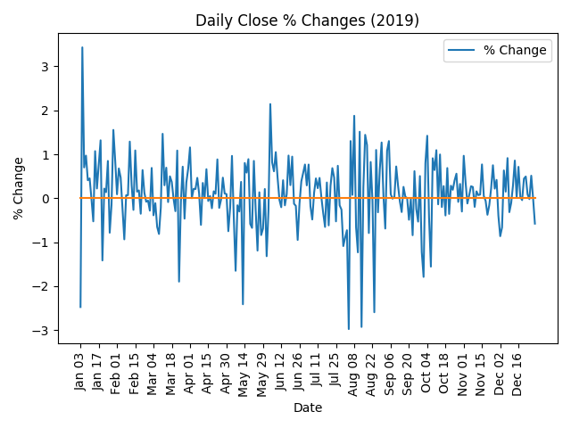

# Stock Market Analysis

This data science project is a collaborative effort to analyze and predict stock market behavior.

## Project Overview

Throughout the project, we will be going over data science concepts to create models that can accurately identify and emphasize trends in stock market data.

To start, we will be looking at various aspects of the data and how specific attributes relate to each other. By doing this, we hope to find correlations
between specific attributes that can then be utilized to create models that accurately predict a range and variety of future values.

From there, we plan to use modern data analysis techniques and libraries (i.e.: TensorFlow) to serve as a platform on which accurate models can be built.

## Motivation

We are both computer engineering students attending Purdue University, wanting to understand the intersection of data science and the Stock Market. We started this project to see what types of predictions and conclusions can be drawn after analyzing historical stock market data using data science algorithms, techniques, and libraries. As a result of working on this project, we both hope to gain a better understanding of and a stronger interest in the Stock Market, the application of data science in this field, and the data science tools and techniques available to help people make investment decisions.

---

## Team

### **Charles Pisciotta**

B.S. Computer Engineering | Honors College - Purdue University | Class of 2022

Charles Pisciotta is currently a rising junior at Purdue University studying computer engineering. Some of his interests include mobile development, technology consulting, and the investment banking industry. As a freshman at Purdue University, he was a member of a hackathon team that placed 3rd at Purdue's 2018 BoilerMake event. That product is now patent-pending and received recognition for its use of Google Cloud. His work experience includes an internship as a Mobile Applications Developer Intern and works as a freelance iOS developer.

 

- Email: [charles.pisciotta1@gmail.com](mailto:charles.pisciotta1@gmail.com)
- GitHub: [cpisciotta](https://github.com/cpisciotta)
- LinkedIn: [charlespisciotta](https://www.linkedin.com/in/charlespisciotta/)
- Website: [charlespisciotta.com](https://www.charlespisciotta.com)

 

### **Brett Weyer**

B.S. Computer Engineering | Honors College - Purdue University | Class of 2022

 

- Email: [brettweyer@gmail.com](mailto:brettweyer@gmail.com)
- GitHub: [Bweyer6](https://github.com/Bweyer6)
- LinkedIn: [brett-weyer](https://www.linkedin.com/in/brett-weyer/)

---

## Dataset

This dataset represents the S&P 500 historical data from the entire duration of 2019. Using this as the initial dataset, conclusions, assumptions, and predictions will be made about the behavior of the S&P 500 and the stock market as a whole.

This dataset can be found [here][Dataset URL] on Yahoo Finance.

| Feature        | Common Unit | Python Unit | Minimum/Start | Maximum/End  | Notes   |
| :--------------: | :---------:   | :-----------: | :-------------: | :------------: | :-------: |
| **Day of Week**    | N/A         | String      | "Monday"     | "Friday"     |         |
| **Date**           | N/A         | String      | "2019-01-02"  | "2019-12-30" |         |
| **Open**           | US Dollar   | Float       | 2474.330078   | 3247.229980  |         |
| **High**           | US Dollar   | Float       | 2443.959961   | 3247.929932  |         |
| **Low**            | US Dollar   | Float       | 2443.959961   | 3234.370117  |         |
| **Close**          | US Dollar   | Float       | 2447.889893   | 3240.020020  |         |
| **Adjusted Close** | US Dollar   | Float       | 2447.889893   | 3240.020020  | This value is consistent with its corresponding `close` value.        |
| **Volume**         | N/A   | Integer       | 1296540000    | 6454270000   |         |

---

## Understanding the Data

Before making any analyses, conclusions, or predictions, the raw data was imported and visualized. Below are some of the visualizations that were generated to assist with understanding the general nature of the data.

  
  

  

  

  

  

  

---

## Analysis Iterations

## 1. Predicting the nth Day's Values from the Average Percent Change of the Previous n-1 Days [IN PROGRESS]

### **Hypothesis**

The initial hypothesis is that for a given amount of days (n-1), the behavior of the stock market on the nth day can be predicted from the average percent change of the n-1 days before it.

### **Process**

This process will initially involve a few steps.

1. Select random, discrete values for n to determine an initial likelihood that a relationship exists.
2. Determine a value for n that best predicts the nth day's values, where n is between 1 and 1 less than the number of data entries.
3. Determine if this approach can be considered an effective predictor of the nth day's values.

### **Results**

### **Conclusions**

## 2. Predict the Next Day's Values Using the Cumulative Average of the Daily Percent Changes [IN PROGRESS]

### **Hypothesis**

The initial hypothesis is that for the next trading day, the behavior of the stock market can be predicted using the cumulative average of the daily percent changes.

### **Process**

1. Calculate the cumulative average of the daily percent changes.
2. Determine the accuracy of the predictions.
3. Determine how to remove outliers, if any exist.

### **Results**

### **Conclusions**

<!--- URL Links --->
[Dataset URL]: https://finance.yahoo.com/quote/%5EGSPC/history?period1=1546300800&period2=1577750400&interval=1d&filter=history&frequency=1d
